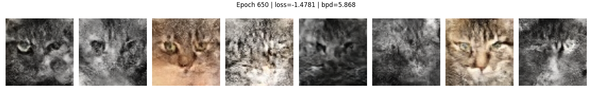
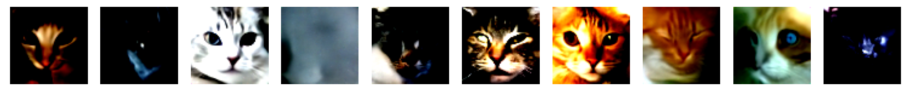

# Comparison of VAE and GAN models for Generative AI

This project explores the evolution of generative models, starting from basic **Autoencoders (AE)** and moving towards more complex architectures like **Variational Autoencoders (VAE)** and different **Generative Adversarial Networks (GAN)**.

The project also introduces other types of architectures, such as autoregressive models like **PixelCNN** (on MNIST), flow-based models like **RealNVP** and **GLOW**, and concludes with diffusion models like **DDPM** using a **U-Net** architecture.

The primary objective is to understand how latent space representation allows models to generate new, high-quality data samples.

### Objectives
* **Understand** the limitations of standard AE for data generation.
* **Implement VAE** to smooth the latent space using probabilistic distributions.
* **Deploy GANs** to produce sharp, realistic samples.
* **Use WGAN-GP** to achieve better stability and model convergence.
* **Compare** the performance and output quality across different architectures.

---
## Requirements

Python 3.10+ is recommended. Install dependencies with:

```bash
pip install -r requirements.txt
```

The following packages are required:

- `tensorflow` — model building and training
- `numpy` — numerical computations
- `PyYAML` — config file parsing
- `matplotlib` — visualizations and loss curves
- `scikit-learn` — preprocessing and evaluation metrics
- `jupyterlab` — running the notebooks
- `seaborn` — enhanced data visualizations

---

## Approach

### 1. AE: Fundamentals
Analysis of how Autoencoders compress data into a bottleneck (latent space) and reconstruct it.
* **Dataset:** MNIST.
* **Goal:** Image reconstruction and visualization of the latent space clusters.

### 2. VAE: From Reconstruction to Generation
Transitioning to Variational Autoencoders by adding a probabilistic layer to the latent space.
* **Dataset:** [Cat faces dataset](https://github.com/fferlito/Cat-faces-dataset).
* **Goal:** Generate new, unique cat images by sampling the latent space.

### 3. GAN: Adversarial Training and WGAN-GP
Implementation of the minimax game between a Generator and a Discriminator.
* **Goal:** Achieve higher image sharpness and overcome the "blurriness" often found in VAEs.
* **Focus:** Using Wasserstein GAN with Gradient Penalty (WGAN-GP) for improved training stability.

first result with a **WGAN-GP**
my hyperparameters choices
* **Latent dim :** 128,  the generator was unstable with 256 dimensions and not enough powerful with 64.
* **Learning rate :** 0.00005, Set low for training stability.
* **n_critic:** 8, Used to prevent the critic from being too weak at the start or too dominant at the end.

<table>
    <tr>
        <td width="50%">
        
        </td>
        <td width="50%">
        
        </td>
    </tr>
</table>
when in 2017 Arjpvsky introduce this new GAN, the goal was to stabilize the training of GAN's. For that the Wgan:
* increases the stability of the optimization
* introduce a loss which gives a better correlation between the generator and the quality of the sample

#### Wasserstein Loss

Original GANs use **Binary Cross Entropy**:

$$- \frac{1}{n} \sum_{i=1}^{n} [y_i \log(p_i) + (1-y_i) \log(1-p_i)]$$

For the Discriminator $D$:
* **Real data** ($y_i=1$): $p_i = D(x)$
* **Generated data** ($y_i=0$): $p_i = D(G(z))$

The loss becomes for the discrimintator:

$$- (\mathbb{E}_{x}[\log D(x)] + \mathbb{E}_{z}[\log(1 - D(G(z)))]) $$

for the generator

$$- (\mathbb{E}_{x}[\log D(G(z))]) $$

**The Problem:**
If the Generator is weak, images are too easy to recognize. The Discriminator reaches perfection too quickly, leading to **vanishing gradients**. The Generator stops improving because the loss signal becomes flat.

**Wasserstein Loss** addresses this by measuring the distance between distributions instead of performing binary classification.

1. **Labels**: $y_i \in \{1, -1\}$ instead of $\{0, 1\}$.
2. **Output**: $D(x)$ is no longer a probability in $[0, 1]$, but a real value score in $\mathbb{R}$.

$$ - \frac{1}{n} \sum_{i=1}^{n} [y_i p_i] $$

**Impact on minimization:**

* **Cross-Entropy**: The loss saturates. Minimization stops because the gradient vanishes when the Discriminator is too accurate.
* **Wasserstein**: The loss provides a smooth, linear gradient. Minimization continues even if the Discriminator is perfect, because the score represents distance rather than a 0/1 probability.

**Lipschitz constraints**

This new loss has an issue: its value can explode to infinity. To prevent this in a neural network, the WGAN paper requires the critic function to be *1-Lipschitz*.

This constraint means that for a critic function $D$ and for two images $x_1$ and $x_2$, we need:

$$ \frac{|D(x_1) - D(x_2)|}{|x_1 - x_2|} \leq 1 $$

In other words, we limit the rate of change between predictions. This ensures the model is stable because the gradient norm is bounded (it must be less than or equal to 1), preventing the "exploding gradient" problem.

#### Progressive GAN

Developed by NVIDIA Labs in 2017 to increase the stability and speed of GANs. The idea is simple: you first train on 4x4 images of your dataset and then increase the size to obtain better results.

However, this training is not usual. Until now, we have built models to generate an image of a fixed size. To overcome this issue, we build a new type of training in which each resolution (except the first 4x4) is going to pass through two different training phases:

1. **Transition:** in which the model is learning from the previous GAN while increasing the size.
2. **Stabilization:** in which we train our GAN like we have done until now.

The stabilization part is not very different from what we have done before. So let's see how the Transition works.

In the transition, a noise vector passes through an upsampling layer which increases the size of the image. After that, the vector is divided into two paths: the first one goes through a new convolutional block to produce a new RGB value, and the second stays as it was in the previous resolution (the existing RGB). Each of them is multiplied by $\alpha$ and $1 - \alpha$ respectively, and they are finally added. This addition gives the new value for the transition.

<table>
    <tr>
        <td width="50%">
        
        </td>
        <td width="50%">
        
        </td>
    </tr>
    <tr>
        <td width="50%">
        
        </td>
        <td width="50%">
        
        </td>
    </tr>
</table>

<table>
    <tr>    
        <td width="100%">
            
        </td>
    </tr>
</table>

### 4. Introduction to PixelCNN
* **Dataset:** MNIST. the cat dataset would ask too much computanional power.
* **Goal:** Observe how an autoregressive model produces images pixel by pixel, conditioned on previous ones.

<table>
    <tr>
        <td width="50%">
        
        </td>
    </tr>
</table>

Proposed by van den Oord in 2016, the goal is to generate a pixel according to the others. To do that, we introduce **masked convolutive layers**.

The goal is simple: every pixel before the current pixel we want to generate is marked as 1 (we apply the kernel to them), and if they are after, we apply 0 because we don't use them to generate the current pixel.

basically it treats image generation as a sequence, predicting one pixel at a time: $P(x) = \prod P(x_i | x_{<i})$.
Unlike GANs, PixelCNN minimizes the **Negative Log-Likelihood (NLL)**. It is much more stable to train but slower to generate, as pixels must be created one by one.


**For those sections the 30k images and the size of the images (64\*64) is an issue to have very good results I'll share the results I succesfully obtained**


### 6. Normalization Models (GLOW)
* **Goal:** Explore how normalization models generate new images.

In normalization models, the goal is to build a function that can normalize our datasets via a probabilistic function $q(z|x)$, where $z$ is a sample from our distribution and $x$ is an image from our dataset. However, we have a condition: this function must be reversible. Thus, we can determine a function $p(x|z)$ that generates an image from our distribution.

This raises a question: how can deep learning create a process that can be inverted, turning a complex distribution into a simple one, like a Gaussian distribution? To do that, we have to understand the change of variables formula.

Effectively, we want to transform a complex distribution into a simple one. If we have a function $f$ representing the distribution of our images in a certain dimension (e.g., $64 \times 64 \times 3$), it is complex. If there exists a change of variables technique to transform this into a function $g$—a function with the same dimension but following a Gaussian distribution—we will be able to map a sample from our Gaussian distribution back into our image space. This way, we can produce new images.

**Change of Variables**

Let's say we have a probability distribution in two dimensions such as:

$$
 \int_{0}^{2}  \int_{1}^{4} p_X(x) \,dx_1 \,dx_2 = 1
$$

with $x = (x_1, x_2)$ and $p_X(x) = \frac{(x_1 - 1)x_2}{9}$.
Now, if we want to scale this distribution to fit into a square of size 1, we must define $z = (z_1,z_2)$ such as:

$$
z = f(x)
$$
$$
z_1 = \frac{x_1 - 1}{3}
$$
$$
z_2 = \frac{x_2}{2}
$$

We can notice that this function is reversible! We now have this new function:

$$
p_Z(z) = \frac{(3z_1 + 1 - 1)2z_2}{9} = \frac{2 z_1 z_2}{3}
$$

However, the integration gives $\frac{1}{6}$, not 1. To find a solution, we introduce the Jacobian determinant. The Jacobian of the function $z=f(x)$ is the matrix of first-order partial derivatives:

$$
\frac{\partial z}{\partial x}  = 
\begin{bmatrix} 
    \frac{\partial z_1}{\partial x_1} & \cdots & \frac{\partial z_1}{\partial x_n} \\ 
    \vdots & \ddots & \vdots \\ 
    \frac{\partial z_m}{\partial x_1} & \cdots & \frac{\partial z_m}{\partial x_n} 
\end{bmatrix}
$$

For our function, we have:

$$
J = \begin{pmatrix} \frac{1}{3} & 0  \\
                    0 & \frac{1}{2} \\
\end{pmatrix}
$$

Its determinant is $\frac{1}{6}$. From this, we can determine that the general equation for the change of variables is:

$$
p_X(x)=p_Z(z) \left| \det\left(\frac{\partial z}{\partial x}\right) \right|
$$

However, there is an issue: computing the determinant costs $O(n^3)$ complexity, which is impossible for high-dimensional images. To solve this, we introduce the coupling layer.

**Coupling Layer**


1. **How they work:** The input $x$ is split into two parts: $[x_{1:d}, x_{d+1:D}]$. The first part is kept identical ($z_{1:d} = x_{1:d}$). The second part is transformed by an affine function (scale $s$ and translation $t$) that depends only on the first part: $z_{d+1:D} = x_{d+1:D} \odot \exp(s(x_{1:d})) + t(x_{1:d})$.

2. **Triangular Jacobian:** Since $z_{1:d}$ only depends on $x_{1:d}$ and $z_{d+1:D}$ depends on both $x_{1:d}$ and $x_{d+1:D}$, the Jacobian matrix is lower triangular. The determinant is simply the product of the diagonal elements (the $\exp(s)$ terms), which is computationally very cheap.

3. **Reversibility:** It is reversible because we can use the unmodified $z_{1:d}$ (which equals $x_{1:d}$) to recompute the same $s$ and $t$ values. We then just perform the inverse math: $x_{d+1:D} = (z_{d+1:D} - t(z_{1:d})) \odot \exp(-s(z_{1:d}))$.
<table>
    <tr>
        <td width="50%">
        
        </td>
    </tr>
</table>

### 7. Diffusion Models (DDPM)
* **Architecture:** U-Net.
* **Goal:** Learn the reverse process of adding noise to data to generate samples from pure Gaussian noise.

The goal  of a *DDM*, Denoising Diffusion Model, is to learn how to train a model to go from a random noise to an image of our dataset  (our seems beung take from our dataset).
lets start with the forward process : from our dataset to gaussian nose.
**Forward Process**
let's suppose we have an image $x_0$ and we want to turn this image into a random gaussian noise through $T = 1000$ steps, in other word $x_T$ as an average equal to zero and a variance equal to one. We can define a function $q$ which add a gaussian noiwe with a variace equal to $\beta_t$ to an image $x_{t-1}$ to generate a new image $x_t$

We do this process $T$ times.

This mathematical process can be defined by:

$$
w_t = \sqrt{1-\beta_t}x_{t-1} + \sqrt{\beta_t}\epsilon_{t-1}
$$

The goal is to keep the same variance during the process.

If we say $x_{t-1}$ has a null average and unitarian variance then because $\text{var}(aX + bY) = a^2\text{Var}(X) + b^2\text{Var}(Y)$ then $x_t$ has a variance of $1-\beta_t + \beta_t = 1$.

In other words we have:

$$
q(x_t | x_{t-1}) = \mathcal{N}(x_t; \sqrt{1 - \beta_t}x_{t-1}, \beta_t\mathcal{I})
$$

Furthermore if we have: $\alpha_t = 1 - \beta_t$ and $\bar{\alpha}_t = \prod_{i=1}^{t} \alpha_i$ we also have:

$$
x_t = \sqrt{\bar{\alpha}_t}x_{0} + \sqrt{1- \bar{\alpha}_t}\epsilon
$$

$$
q(x_t | x_0) = \mathcal{N}(x_t; \sqrt{\bar{\alpha}_t}x_{0}, (1- \bar{\alpha}_t)\mathcal{I})
$$

**Choice of $\beta_t$**

We can choose freely a value for $\beta_t$. We can choose a linear value like in the original article of Ho but we can also choose an ordonnancement de diffusion in cosinus like Alex Nichol and Prafulla Dhariwal in 2021.

If we have:

$$
\bar{\alpha}_t = \cos^2\left(\frac{t}{T} \frac{\pi}{2}\right)
$$

we have (with $\cos^2(x) + \sin^2(x) = 1$):

$$
x_t = \cos\left(\frac{t}{T} \frac{\pi}{2}\right)x_0 + \sin\left(\frac{t}{T} \frac{\pi}{2}\right)\epsilon
$$

**Backward Process**

Now we want to create a neural network such as $p(x_{t-1} | x_t)$ can reverse the noising. In other words, we want to approximate the distribution $q(x_{t-1} | x_t)$. If we can do that, then we can create new images from the distribution $\mathcal{N}(0, \mathcal{I})$.

To do that, the goal is to compute the transformation of $x_0$ to $x_t = \sqrt{\bar{\alpha_t}}x_{0} + \sqrt{1 - \bar{\alpha_t}}\epsilon$. After that, we give the value $\bar{\alpha_t}$ to our neural network and it has to predict the value $\epsilon$.

To perform this prediction, we generally use a **U-Net** architecture. This network is composed of different specialized blocks:

A **Residual Block** is the core unit of the network. Instead of learning a direct mapping, it learns the difference (the residue) between the input and output. It uses a skip connection that adds the original input $x$ to the result of the internal convolutions: $f(x) + x$.

The **Down Block** is used in the first half of the U-Net. Its role is to reduce the spatial resolution of the image (making it smaller in width and height) while increasing the number of feature channels. This allows the model to "see" the image at a more abstract, global level to identify what kind of noise needs to be removed across the whole scene.

The **Up Block** is used in the second half of the U-Net. It does the opposite of the Down Block: it increases the spatial resolution (upsampling) to bring the image back to its original size. It combines the abstract features learned in the bottleneck with high-resolution details passed directly from the Down Blocks via skip connections.

The **U-Net** is the engine of the Backward Process. Its "U" shape allows it to first compress the noisy image $x_t$ to capture its global context (via Down Blocks) and then reconstruct the precise noise map $\epsilon$ (via Up Blocks). In our DDM, the U-Net takes the noisy image $x_t$ and a representation of the timestep $t$ as inputs. Its final output is the predicted noise $\epsilon$. Once we know $\epsilon$, we can subtract it from $x_t$ to step back toward the clean image $x_0$, effectively reversing the entropy added during the Forward Process.

<table>
    <tr>
        <td width="50%">
        
        </td>
    </tr>
</table>

## Bibliographie

### Manuals

- Géron, A. *Machine Learning avec Scikit-Learn*. Dunod.
- Charniak, E. *Introduction au Deep Learning*. Dunod.
- Géron, A. *Deep Learning avec TensorFlow*. Dunod.
- Foster, D. *Deep learning génératif*. Dunod.
