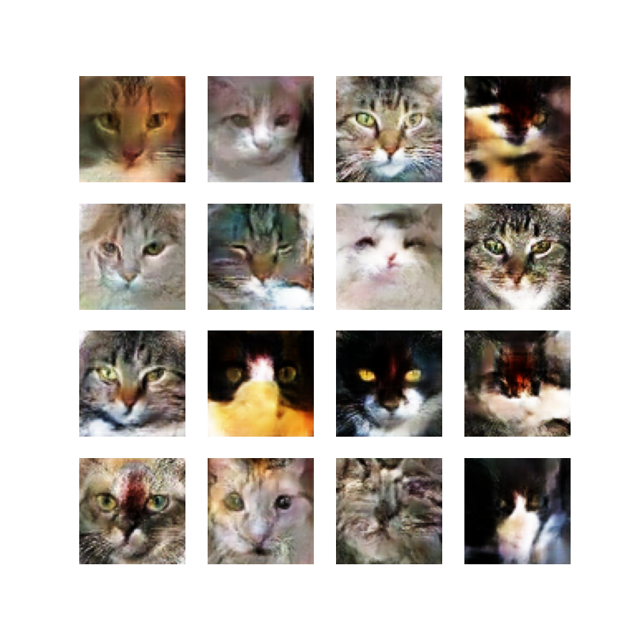
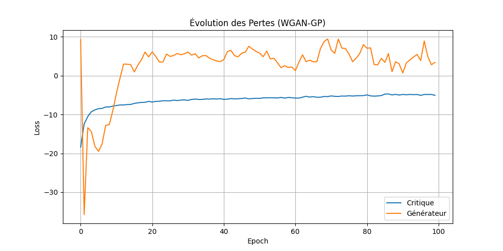
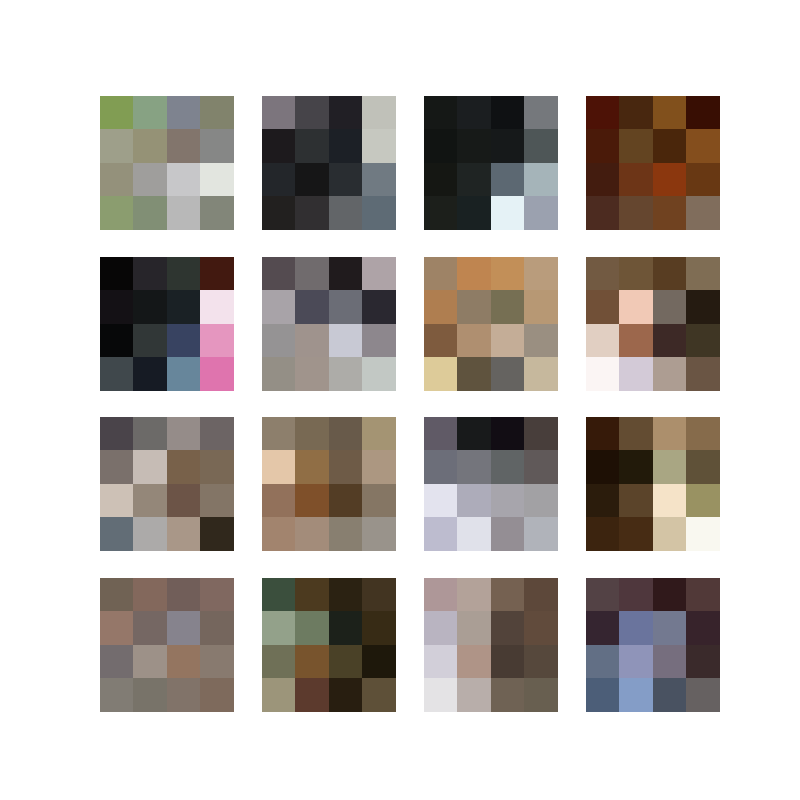
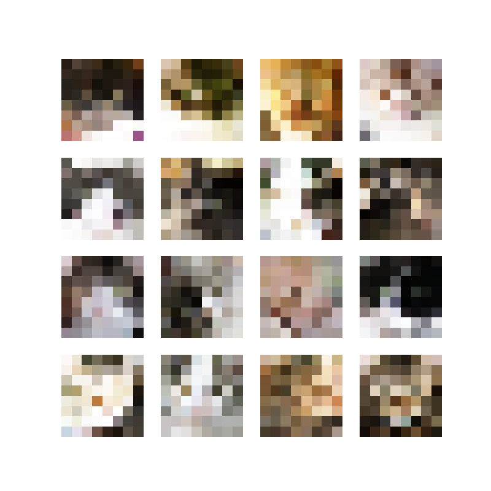
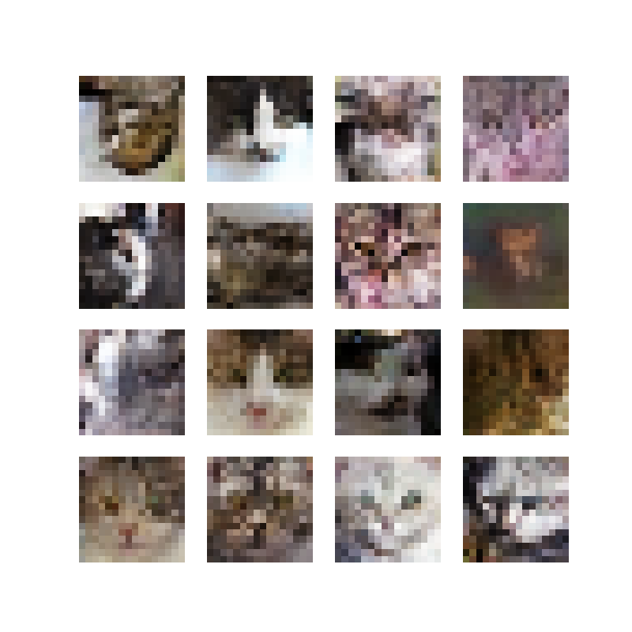
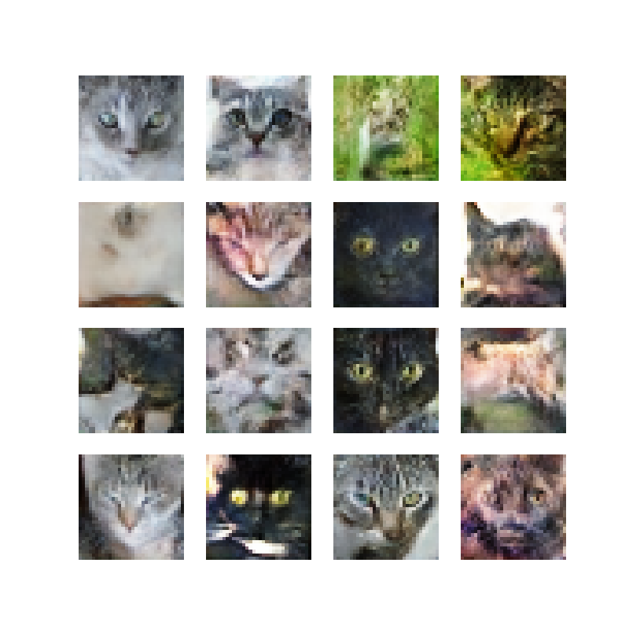
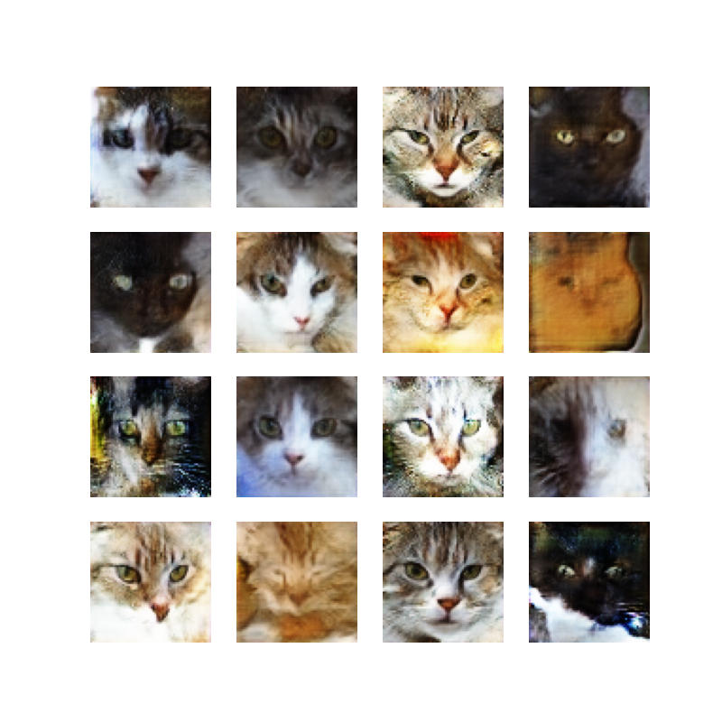
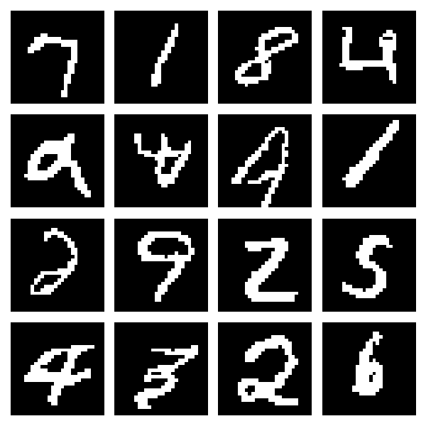

# Comparison of VAE and GAN models for Generative AI

This project explores the evolution of generative models, starting from basic **Autoencoders (AE)** and moving towards more complex architectures like **Variational Autoencoders (VAE)** and different **Generative Adversarial Networks (GAN)**.

The project also introduces other types of architectures, such as autoregressive models like **PixelCNN** (on MNIST), flow-based models like **RealNVP** and **GLOW**, and concludes with diffusion models like **DDPM** using a **U-Net** architecture.

The primary objective is to understand how latent space representation allows models to generate new, high-quality data samples.

### Objectives
* **Understand** the limitations of standard AE for data generation.
* **Implement VAE** to smooth the latent space using probabilistic distributions.
* **Deploy GANs** to produce sharp, realistic samples.
* **Use WGAN-GP** to achieve better stability and model convergence.
* **Compare** the performance and output quality across different architectures.

---

## Approach

### 1. AE: Fundamentals
Analysis of how Autoencoders compress data into a bottleneck (latent space) and reconstruct it.
* **Dataset:** MNIST.
* **Goal:** Image reconstruction and visualization of the latent space clusters.

### 2. VAE: From Reconstruction to Generation
Transitioning to Variational Autoencoders by adding a probabilistic layer to the latent space.
* **Dataset:** [Cat faces dataset](https://github.com/fferlito/Cat-faces-dataset).
* **Goal:** Generate new, unique cat images by sampling the latent space.

### 3. GAN: Adversarial Training and WGAN-GP
Implementation of the minimax game between a Generator and a Discriminator.
* **Goal:** Achieve higher image sharpness and overcome the "blurriness" often found in VAEs.
* **Focus:** Using Wasserstein GAN with Gradient Penalty (WGAN-GP) for improved training stability.

first result with a **WGAN-GP**
my hyperparameters choices
* **Latent dim :** 128,  the generator was unstable with 256 dimensions and not enough powerful with 64.
* **Learning rate :** 0.00005, Set low for training stability.
* **n_critic:** 8, Used to prevent the critic from being too weak at the start or too dominant at the end.

<table>
    <tr>
        <td width="50%">
        
        </td>
        <td width="50%">
        
        </td>
    </tr>
</table>
when in 2017 Arjpvsky introduce this new GAN, the goal was to stabilize the training of GAN's. For that the Wgan:
* increases the stability of the optimization
* introduce a loss which gives a better correlation between the generator and the quality of the sample

#### Wasserstein Loss

Original GANs use **Binary Cross Entropy**:

$$- \frac{1}{n} \sum_{i=1}^{n} [y_i \log(p_i) + (1-y_i) \log(1-p_i)]$$

For the Discriminator $D$:
* **Real data** ($y_i=1$): $p_i = D(x)$
* **Generated data** ($y_i=0$): $p_i = D(G(z))$

The loss becomes for the discrimintator:
$$- (\mathbb{E}_{x}[\log D(x)] + \mathbb{E}_{z}[\log(1 - D(G(z)))])$$

for the generator

$$- (\mathbb{E}_{x}[\log D(G(z))]) $$

**The Problem:**
If the Generator is weak, images are too easy to recognize. The Discriminator reaches perfection too quickly, leading to **vanishing gradients**. The Generator stops improving because the loss signal becomes flat.

**Wasserstein Loss** addresses this by measuring the distance between distributions instead of performing binary classification.

1. **Labels**: $y_i \in \{1, -1\}$ instead of $\{0, 1\}$.
2. **Output**: $D(x)$ is no longer a probability in $[0, 1]$, but a real value score in $\mathbb{R}$.

$$ - \frac{1}{n} \sum_{i=1}^{n} [y_i p_i] $$

**Impact on minimization:**

* **Cross-Entropy**: The loss saturates. Minimization stops because the gradient vanishes when the Discriminator is too accurate.
* **Wasserstein**: The loss provides a smooth, linear gradient. Minimization continues even if the Discriminator is perfect, because the score represents distance rather than a 0/1 probability.

**Lipschitz constraints**

This new loss has an issue: its value can explode to infinity. To prevent this in a neural network, the WGAN paper requires the critic function to be *1-Lipschitz*.

This constraint means that for a critic function $D$ and for two images $x_1$ and $x_2$, we need:

$$ \frac{|D(x_1) - D(x_2)|}{|x_1 - x_2|} \leq 1 $$

In other words, we limit the rate of change between predictions. This ensures the model is stable because the gradient norm is bounded (it must be less than or equal to 1), preventing the "exploding gradient" problem.

#### Progressive GAN

Developed by NVIDIA Labs in 2017 to increase the stability and speed of GANs. The idea is simple: you first train on 4x4 images of your dataset and then increase the size to obtain better results.

However, this training is not usual. Until now, we have built models to generate an image of a fixed size. To overcome this issue, we build a new type of training in which each resolution (except the first 4x4) is going to pass through two different training phases:

1. **Transition:** in which the model is learning from the previous GAN while increasing the size.
2. **Stabilization:** in which we train our GAN like we have done until now.

The stabilization part is not very different from what we have done before. So let's see how the Transition works.

In the transition, a noise vector passes through an upsampling layer which increases the size of the image. After that, the vector is divided into two paths: the first one goes through a new convolutional block to produce a new RGB value, and the second stays as it was in the previous resolution (the existing RGB). Each of them is multiplied by $\alpha$ and $1 - \alpha$ respectively, and they are finally added. This addition gives the new value for the transition.

<table>
    <tr>
        <td width="50%">
        
        </td>
        <td width="50%">
        
        </td>
    </tr>
    <tr>
        <td width="50%">
        
        </td>
        <td width="50%">
        
        </td>
    </tr>
</table>

<table>
    <tr>    
        <td width="100%">
            
        </td>
    </tr>
</table>

### 4. Introduction to PixelCNN
* **Dataset:** MNIST. the cat dataset would ask too much computanional power.
* **Goal:** Observe how an autoregressive model produces images pixel by pixel, conditioned on previous ones.

<table>
    <tr>
        <td width="50%">
        
        </td>
    </tr>
</table>

Proposed by van den Oord in 2016, the goal is to generate a pixel according to the others. To do that, we introduce **masked convolutive layers**.

The goal is simple: every pixel before the current pixel we want to generate is marked as 1 (we apply the kernel to them), and if they are after, we apply 0 because we don't use them to generate the current pixel.

basically it treats image generation as a sequence, predicting one pixel at a time: $P(x) = \prod P(x_i | x_{<i})$.
Unlike GANs, PixelCNN minimizes the **Negative Log-Likelihood (NLL)**. It is much more stable to train but slower to generate, as pixels must be created one by one.

### 5. RealNVP (Flow-based Model)
* **Concept:** Implementing non-volume preserving (NVP) transformations.
* **Goal:** Use invertible mapping to transform a simple distribution into a complex data distribution.

### 6. GLOW
* **Goal:** Explore more efficient and scalable generative flows.

### 7. Diffusion Models (DDPM)
* **Architecture:** U-Net.
* **Goal:** Learn the reverse process of adding noise to data to generate samples from pure Gaussian noise.

## Bibliographie

### Manuals

- Géron, A. *Machine Learning avec Scikit-Learn*. Dunod.
- Charniak, E. *Introduction au Deep Learning*. Dunod.
- Géron, A. *Deep Learning avec TensorFlow*. Dunod.
- Foster, D. *Deep learning génératif*. Dunod.
